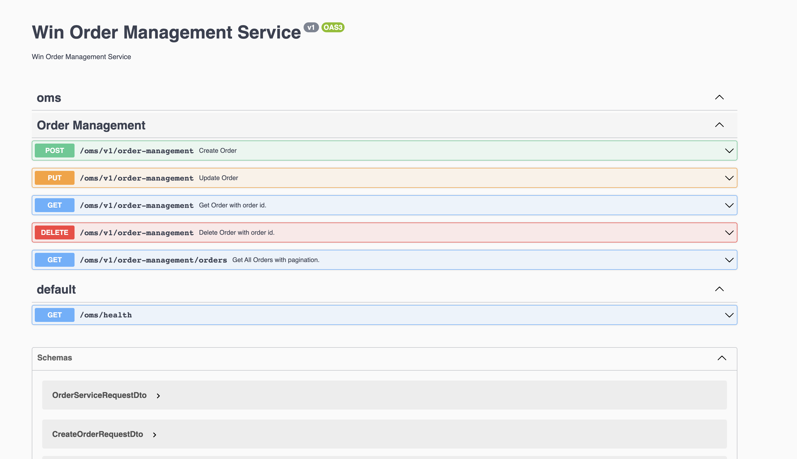

# Order Management System

## Tech Stack Used:

- **Nest JS :** => A progressive Node.js framework for building efficient, reliable and scalable server-side applications.
- **MongoDB:** => MongoDB is a source-available cross-platform document-oriented database.

## Folder Structure

- [X] src
    - [X] **common** : Include request interceptor.
    - [X] **config** : Manage the configuration of the service. ie: port , app name , db url , app key etc.
    - [X] **enums**: Constant value used in project.
    - [X] **errors**: A api for making generic error in whole project.
    - [X] **oms** : Order Management Module
        - [X] **dto** : Data transfer object for api
        - [X] **entity** : Database schema.
        - [X] **controller** : Routing
        - [X] **provider**: Business logic for the application.
    - [X] **role**: Role Based Access: public api , platform api, admin api
    - [X] **utils**: Common maths.

## Steps to start application:
 - `nest start`: This command will spin up the server.
 - After spinning up the server. Visit `http://localhost:3000/api/` for swagger document of an api.


## Assumption while developing
- I believe that price of order will be dependent on services. So i have added amount field to service.
- The summation of item price will be the order price.

## API's

- **POST: Create Order** `/oms/v1/order-management`

```curl
   curl --location --request POST 'http://localhost:3000/oms/v1/order-management' \
--header 'Authorization: 1510480e-d9f2-11ed-afa1-0242ac120002' \
--header 'Content-Type: application/json' \
--data-raw '{
    "user_id": "Atul",
    "services": [
        {
            "name": "Pencil",
            "amount": 12
        },
       {
            "name": "Pen",
            "amount": 13
        }
    ]
}'

```

- **PUT: Update Order** `/oms/v1/order-management`

```curl

curl --location --request PUT 'http://localhost:3000/oms/v1/order-management' \
--header 'Authorization: 1510480e-d9f2-11ed-afa1-0242ac120002' \
--header 'Content-Type: application/json' \
--data-raw '{
    "id": "db664fd7-a000-4f01-a72e-1993d4a91c06",
    "order_items": [
        {
            "name": "Pen",
            "amount": 12
        },
        {
            "name": "Pencil",
            "amount": 13
        }
    ]
}'

```

- **Get: Get Order** `/oms/v1/order-management`

```curl
curl --location --request GET 'http://localhost:3000/oms/v1/order-management?id=115db568-a7b5-4c1d-854d-075b598d0566' \
--header 'Authorization: 1510480e-d9f2-11ed-afa1-0242ac120002' \
--data-raw ''

```

- **Get: Get All Orders** `/oms/v1/order-management/orders`

```curl
curl --location --request GET 'http://localhost:3000/oms/v1/order-management/orders?page=0&page_size=10' \
--header 'Authorization: 115db568-a7b5-4c1d-854d-075b598d0566'
```

***


## How to run Test Case
 
- stop the docker using command `docker-compose down`
- Again start the docker using command `docker-compose up mongodb_container`
- Run command `npm run test:e2e` 
- Hurray yor test will successfully executed.

###  What extra we can do in future?

- Payment information in order document.
- Currency information in order document.
- Order Status: Started , Refunded etc
- Country information in document.
- Device information.(mobile , ios , web)
- Built in cart managment service and many more.
