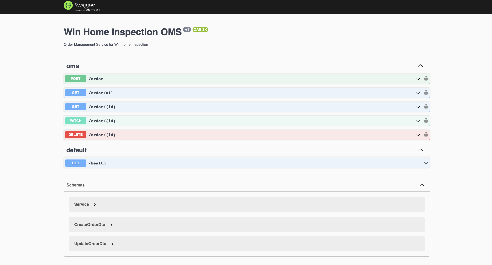

<p align="center">
  <a href="http://nestjs.com/" target="blank"></a>
</p>

  <p align="center">Order Management System for Win Home Inspection</p>
    <p align="center">
  <p align="center"><a href="http://localhost:3000/api">Swagger Documentation</a></p>
    <p align="center">


## API Information - 

- Create Order - Users can create new orders by providing required services
```
Method: POST
Path: /oms/order
Parameters: None
Header : Authorization : '9748-439d'
Request Body:{
  "services": [
    {
      "id": "e225266d-9748-439d-8e2d-5be5f313cb44",
      "amount": 10
    }
  ],
  "user_id": "e225266d-9748-439d-8e2d-5be5f313cb44"
}
``` 
- Update Order - Users can update previously placed orders after 3 hours of creation/updation
```
Method: PATCH
Path: /oms/order/{id}
Parameters: None
Header : Authorization : '9748-439d'
Request Body: {
  "services": [
    {
      "id": "e225266d-9748-439d-8e2d-5be5f313cb44",
      "amount": 100
    }
  ],
  "order_id": "e225266d-9748-439d-8e2d-5be5f313cb44"
}
```
- Fetch Order: User can retrive order details with the help of order id
```
Method: GET
Header : Authorization : '9748-439d'
Path: /oms/order/{id}
Parameters:
id (required, string)
```
- Delete Order : User can delete order with the help of order id
```
Method: DELETE
Header : Authorization : '9748-439d'
Path: /oms/order/{id}
Parameters:
id (required, string)
```
- Get All Orders : User can retrive orders by passing in user_id and pagination information
```
Method: GET
Header : Authorization : '9748-439d'
Path: /oms/order/all
Parameters:
page (required, number)
page_size (required, number)

```
- Health : Health check to make sure our service is up and running
```
Method: GET
Header : Authorization : '9748-439d'
Path: /oms/health
Parameters: None
```

## Description
  OMS is a service implemented using Nestjs with Express and MongoDB.It uses Mongoose typeORM for connection and any modification related to Data.It contains a total of 6 APIs out of 5 are responsible for Order Management and one API for health check.
  This service should fulfill all the requirements of the assignment.
  I've also inclued a docker componse file to run mongodb 

## Trade Off and assumption
- Auth is hardcoded for now 
- Skipped verification for Services , assuming services will be present in db
- Less testing and less comments
- I've assumed user is already logged in 
- I've taken service pricing from user itself for now 

## Before Prod release
- Proper Role based authorization system
- Setup Service Module and integration
- Increase test coverage to > 95
- Stress Testing 
- Add a open telemetry system like aspecto
- Rate limiting 

</a>

## Installation

```bash
$ npm install
```

## Running the app

```bash
#  the Mongo Server
$ docker compose up

# development
$ npm run start

# watch mode
$ npm run start:dev

# production mode
$ npm run start:prod
```

## Test

```bash
# unit tests
$ npm run test

# e2e tests
$ npm run test:e2e

# test coverage
$ npm run test:cov
```

## Expected Results

- [x] An internal web service API for managing orders
- [x] A test suite to validate the web service and library work as expected
- [x] Service should implement several endpoints that accept POST, GET, PUT and DELETE requests. Also 1 endpoint that accepts GET all orders.
- [x] Your service should handle edge cases appropriately and return appropriate HTTP status codes.
- [x] Your service should return an error on creation/updating an order within 3 hrs of a pre-existing order.
- [x] Your service should return JSON results.
- [x] Your service should have at least one test.
